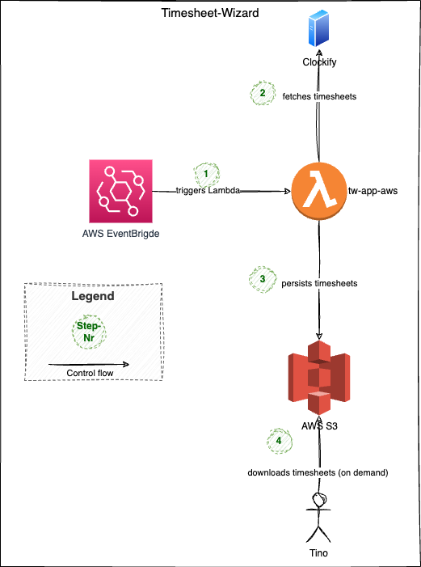

# What is the Timesheet-Wizard?

The Timesheet-Wizard is a personal pet project to fetch timesheets from [Clockify](https://clockify.me/de/), transform
them to various formats and export them again into other tools.

As of now, the only target formats that are supported are XLSX, PDF and CSV, resulting in the
following main features of Timesheet-Wizard:

- Fetch timesheets from Clockify
- Generate & store XLSX files from these timesheets
- Generate & store PDF files from these timesheets
- Generate & store CSV files from these timesheets

## Motivation

As a freelance Software-Engineer & -Architect doing mostly time & material contracting, tracking my working hours is
quite essential. To ease this, I'm using [Clockify](https://clockify.me/). It's an awesome tool with a nice UI that
allows me to track and also categorize my working hours. Besides supporting some Excel-reports out of the box, it also
provides an API to export reports in json-format as well.

In order to have the freedom to customize the reports as much as I like and to transfer these reports automatically to
other tools, I decided to create my own little application allowing me to do that: the Timesheet-Wizard.

In addition to the business motivation mentioned above, this is also a perfect opportunity to play around with
technology in the [function-as-a-service](https://en.wikipedia.org/wiki/Function_as_a_service) territory.
And to be honest: this was the main reason for creating the Timesheet-Wizard.

## Documentation

A more verbose documentation of the architecture following [arc42](https://arc42.org/) can be found in
the [doc-folder](docs/README.md).

### TL;DR

The Timesheet-Wizard consists of two independent modules (realized as Kotlin packages) with the following
responsibilities:

**import**

- importing timesheets from Clockify
- transforming them into the domain model

**export**

- generating XLSX, PDF & CSV files from the domain model
- storing the XLSX, PDF & CSV files on S3

Timesheet-Wizard is

- a Spring Boot application
- written in Kotlin
- built with Gradle
- deployed continuously
  using [AWS SAM](https://docs.aws.amazon.com/serverless-application-model/latest/developerguide/what-is-sam.html) and
  GitHub Actions
- running as AWS Lambda function
- following the infrastructure-as-code-approach with provisioning
  via [AWS Cloudformation](https://aws.amazon.com/cloudformation/?nc1=h_ls)
- triggered by AWS EventBridge

## Getting started

### Prerequisites

- Java 21+
- Gradle
- Docker (for tests using testcontainers)
- [AWS SAM CLI](https://docs.aws.amazon.com/serverless-application-model/latest/developerguide/install-sam-cli.html) (for building & invoking as Lambda on local machine)
- [Azure CLI](https://learn.microsoft.com/de-de/cli/azure/) (for building as Azure Function on local machine)
- [Azure Functions Core Tools](https://learn.microsoft.com/en-us/azure/azure-functions/functions-run-local) (for invoking as Azure Function on local machine)

### Build & test

- Build & test the application with `gradle test`

### Run from local machine - there are multiple options to do that

#### Preparation

- Replace placeholders in [application.yml](src/main/resources/application.yml) with real Clockify credentials. Or
  override them in a 'confidential' profile not commited to version control.
    - timesheet-wizard.import.clockify.api-key
    - timesheet-wizard.import.clockify.workspace-id
- Create & upload configuration file to cloud storage. An example file is
  shown [here](src/test/resources/e2e/config/configuration.json).
    - Use [Minio](http://localhost:9001/) for local AWS emulation
    - Azureite via [Azure Storage Explorer](https://github.com/microsoft/AzureStorageExplorer) for local Azure emulation
    - S3 for remote AWS calls

#### ... as Spring Boot Application with local Azureite as Azure Blob Storage (no connection to Azure)

- Start Azureite as local Azure Blob Storage with `docker compose up`
- Set import params
  in [ImportRunner](src/main/kotlin/dev/hertlein/timesheetwizard/ImportRunner.kt)
- Execute the application with profile 'local':
  `./gradlew bootRun --args='--spring.profiles.active=local,confidential,azure'`

#### ... as Azure Function with local Azureite as Azure Blob Storage (no connection to Azure)

- Start Azureite as local Azure Blob Storage with `docker compose up`
- `export SPRING_PROFILES_ACTIVE=local,confidential,azure`
- `./gradlew azureFunctionsRun`

#### ... as Spring Boot Application with local Minio as S3 storage (no connection to AWS)

- Start Minio as local S3 storage with `docker compose up`
- Set import params
  in [ImportRunner](src/main/kotlin/dev/hertlein/timesheetwizard/ImportRunner.kt)
- Execute the application with profile 'local':
  `./gradlew bootRun --args='--spring.profiles.active=local,confidential,aws'`

#### ... as Spring Boot Application with connection to AWS S3

- Set AWS credentials based on
  the [authentication method](https://docs.aws.amazon.com/prescriptive-guidance/latest/modernization-net-applications-security/iam-development.html)
  you want to use
- Set import params
  in [ImportRunner](src/main/kotlin/dev/hertlein/timesheetwizard/ImportRunner.kt)
- Execute the application with profile 'remote':
  `./gradlew bootRun --args='--spring.profiles.active=remote,confidential,aws'`

#### ... as AWS Lambda with AWS SAM CLI

- Set import params in [requests/public/event.json](requests/public/event.json)
- Build: ` ./requests/public/build.sh`
- Invoke locally: `./requests/public/invoke-local.sh`
- Invoke remotely in AWS: `./requests/public/invoke-remote.sh`