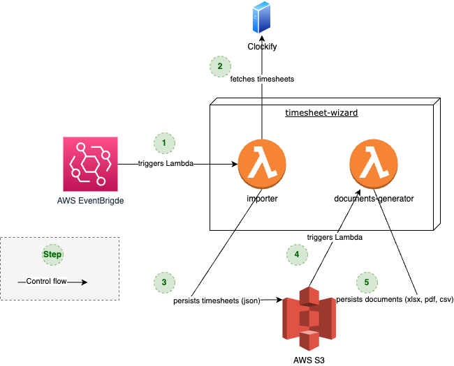

# What is the Timesheet-Wizard?

The Timesheet-Wizard is a personal project to fetch timesheets from [Clockify](https://clockify.me/de/), transform them to various formats
and export them again into other tools.

As of now, the only target format that is supported is Excel, resulting in the
following main features of Timesheet-Wizard:

- Fetch timesheets from Clockify
- Generate Excel files from these timesheets
- Store the Excel files

## Motivation

As a freelance Software-Engineer & -Architect doing mostly time & material contracting, tracking my working hours is
quite essential. To ease this, I'm using [Clockify](https://clockify.me/). It's an awesome tool with a nice UI that
allows me to track and also categorize my working hours. Besides supporting some Excel-reports out of the box, it also
provides
an API to export reports in json-format as well.

In order to have the freedom to customize the reports as much as I like and to transfer these reports automatically to
other tools, I decided to create my own little application
allowing me to do that: the Timesheet-Wizard.

In addition to the business motivation mentioned above, this is also a perfect opportunity to play around with
technology in the [function-as-a-service](https://en.wikipedia.org/wiki/Function_as_a_service) territory.
And to be honest: this was the main reason for creating the Timesheet-Wizard.

## Documentation

A more verbose documentation of the architecture following [arc42](https://arc42.org/) can be found in
the [doc-folder](doc/README.md).

### TL;DR

The Timesheet-Wizard consists of two independent submodules with the following responsibilities:

**import-from-clockify**

- importing timesheets from Clockify
- transforming them into the domain model
- storing the json-representation of the timesheets in S3

**generate-exports**

- downloading the json-representation of the timesheets from S3
- generating Excel files from that
- storing the Excel files again on S3

**import-from-clockify** is a [Micronaut application](https://micronaut.io/) written in Kotlin, built with Gradle and deployed to AWS Lambda as a GraalVM native
image with a custom runtime.

**generate-exports** is a [Quarkus application](https://quarkus.io/) written in Kotlin, built with Gradle and deployed to AWS Lambda on a Java 17 runtime - due to
incompatibility of Apache POI not as a GraalVM native image with a custom runtime.

Both submodules

- do not have any dependencies on each other
- do not share code in a common library or the like
- are realized following a [Ports & Adapters](https://en.wikipedia.org/wiki/Hexagonal_architecture_(software))
  architecture
- are built & deployed continuously using [AWS SAM](https://docs.aws.amazon.com/serverless-application-model/latest/developerguide/what-is-sam.html) and GitHub Actions
- follow the infrastructure-as-code-approach with provisioning via [AWS Cloudformation](https://aws.amazon.com/cloudformation/?nc1=h_ls) 

## Getting started

As there is a bit of a setup needed to get this running locally on your machine or in AWS, I suggest you stick with the E2E tests.

But if you really want to try: feel free - but I won't provide any support nor detailed instructions how to do that. Just some hints:

- create a Clockify account (including an API-key)
- create an AWS account
- install AWS SAM for local build & testing 
- create an AWS S3 bucket to upload the CloudFormation stack and configure samconfig.toml appropriately
- set env variables for Clockify- & AWS-access and to configure customers
- have a look at the code - especially the E2E tests - how this all is working together

### Running E2E Tests locally

- Every module has its own E2E test, that can be executed without any AWS- or Clockify account information. Simply start
  them and have Docker running for the TestContainers:
    - `import-from-clockify/src/test/kotlin/dev/hertlein/timesheetwizard/importclockify/ApplicationE2ET.kt`
    - `generate-exports/src/test/kotlin/dev/hertlein/timesheetwizard/generateexports/ApplicationE2ET.kt` 
