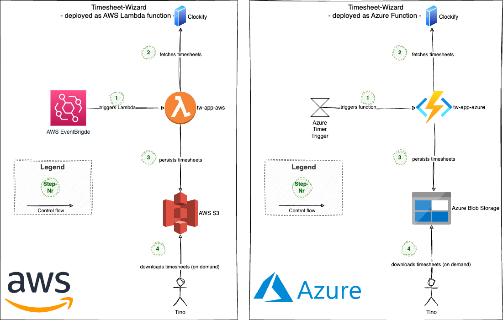

# What is the Timesheet-Wizard?

The Timesheet-Wizard is a personal pet project to fetch timesheets from [Clockify](https://clockify.me/de/), transform
them to various formats and export them again into other tools.

As of now, the only target formats that are supported are XLSX, PDF and CSV, resulting in the
following main features of Timesheet-Wizard:

- Fetch timesheets from Clockify
- Generate & store XLSX files from these timesheets
- Generate & store PDF files from these timesheets
- Generate & store CSV files from these timesheets

## Motivation

As a freelance Software-Engineer & -Architect doing mostly time & material contracting, tracking my working hours is
quite essential. To ease this, I'm using [Clockify](https://clockify.me/). It's an awesome tool with a nice UI that
allows me to track and also categorize my working hours. Besides supporting some Excel-reports out of the box, it also
provides an API to export reports in json-format as well.

In order to have the freedom to customize the reports as much as I like and to transfer these reports automatically to
other tools, I decided to create my own little application allowing me to do that: the Timesheet-Wizard.

In addition to the business motivation mentioned above, this is also a perfect opportunity to play around with
technology in the [function-as-a-service](https://en.wikipedia.org/wiki/Function_as_a_service) territory. That's the
reason, why the Timesheet Wizard is bundled and deployed to multiple hyperscalers - at the moment it's
only [AWS Lambda](https://aws.amazon.com/de/lambda) & [Azure
Functions](https://learn.microsoft.com/en-us/azure/azure-functions/functions-overview?pivots=programming-language-java).

## Documentation

A more verbose documentation of the architecture following [arc42](https://arc42.org/) can be found in
the [doc-folder](docs/README.md).

### TL;DR

#### The Timesheet-Wizard is

- a Spring Boot application
- written in Kotlin
- built with Gradle
- deployed continuously to the cloud using [GitHub Actions](https://github.com/features/actions)
- running as **AWS Lambda** function and also as **Azure Function**
- following the infrastructure-as-code-approach with provisioning
  via [AWS Cloudformation](https://aws.amazon.com/cloudformation/?nc1=h_ls)
  and [Azure Bicep](https://learn.microsoft.com/en-us/azure/azure-resource-manager/bicep/overview?tabs=bicep)
- triggered by AWS EventBridge and Azure Function triggers

#### The Timesheet-Wizard consists of four Gradle subprojects:

- **tw-cloud-spi**: the service provider interface to be implemented for any cloud specific things. Like e.g. uploading
  timesheets to some cloud storage.
- **tw-core**: the code module that contains the business logic. This subproject is cloud-agnostic.
- **tw-app-aws**: implements the interfaces defined in `tw-cloud-spi` with AWS specific code and also bundles the
  cloud-agnostic `tw-core` with AWS specific things to an AWS Lambda function.
- **tw-app-azure**: implements the interfaces defined in `tw-cloud-spi` with Azure specific code and also bundles the
  cloud-agnostic `tw-core` with Azure specific things to an Azure Function.

The `tw-core` Gradle subproject consists of two independent modules (realized as Kotlin packages) with the following
responsibilities:

**import**

- importing timesheets from Clockify
- transforming them into the domain model

**export**

- generating XLSX, PDF & CSV files from the domain model
- storing the XLSX, PDF & CSV files on AWS S3 or Azure Blob Storage

## Getting started

### Prerequisites

- Java 21+
- Gradle
- Docker (for tests using testcontainers)
- [AWS SAM CLI](https://docs.aws.amazon.com/serverless-application-model/latest/developerguide/install-sam-cli.html) -
  for building & invoking as AWS Lambda on local machine
- [Azure Core Tools](https://learn.microsoft.com/en-us/azure/azure-functions/functions-run-local?tabs=linux%2Cisolated-process%2Cnode-v4%2Cpython-v2%2Chttp-trigger%2Ccontainer-apps&pivots=programming-language-java#install-the-azure-functions-core-tools) -
  for building & invoking as Azure Function App on local machine

### Build & test

- Build with `gradle build`

### Run

#### as AWS Lambda with AWS SAM CLI on local machine

- Emulate S3 storage with Minio in [docker-compose.yml](docker-compose.yml)
- Create & upload the configuration file to local S3
   - Example file is shown [here](config/public/configuration.json)
- Replace placeholders
  in [tw-app-aws/requests/public/env.json](tw-app-aws/requests/public/env.json) with your keys
- Set import params in [tw-app-aws/requests/public/event.json](tw-app-aws/requests/public/event.json)
- Build the AWS Lambda function
  locally: [tw-app-aws/requests/public/build.sh](tw-app-aws/requests/public/build.sh)
- Invoke the AWS Lambda function
  locally: [tw-app-aws/requests/public/invoke-local.sh](tw-app-aws/requests/public/invoke-local.sh)

#### as Azure Function App on local machine

- Emulate Azure Blob Storage with Azureite in [docker-compose.yml](docker-compose.yml)
- Create & upload the configuration file to local Azure Storage to `tw-sheets/config`
    - E.g. via [Azure Storage Explorer](https://azure.microsoft.com/en-us/products/storage/storage-explorer)
    - Example file is shown [here](config/public/configuration.json)
- Replace placeholders
  in [tw-app-azure/requests/public/run-function-local.sh](tw-app-azure/requests/public/run-function-local.sh) with your
  keys
- Build & run the Azure Function
  locally: [tw-app-azure/requests/public/run-function-local.sh](tw-app-azure/requests/public/run-function-local.sh)
- Invoke the Azure Function
  locally: [tw-app-azure/requests/public/invoke-function.http](tw-app-azure/requests/public/invoke-function.http)