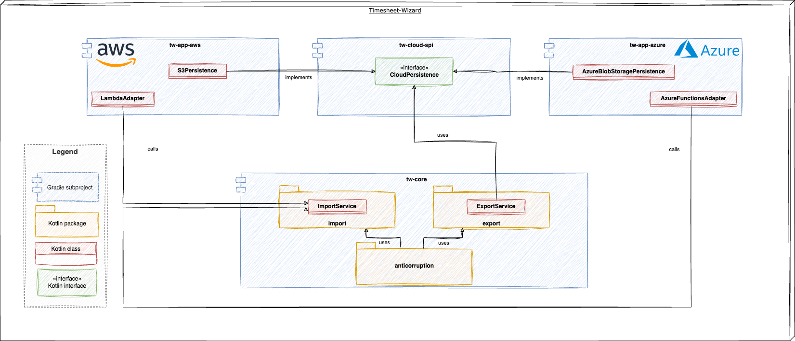

# What is the Timesheet-Wizard?

The Timesheet-Wizard is a personal pet project to fetch timesheets from [Clockify], transform
them to various formats and export them again into other tools.

As of now, the only target formats that are supported are XLSX, PDF and CSV, resulting in the
following main features of Timesheet-Wizard:

- Fetch timesheets from Clockify
- Generate XLSX files from imported timesheets & store them
- Generate PDF files from imported timesheets & store them
- Generate CSV files from imported timesheets & store them

## Motivation

As a freelance Software-Engineer & -Architect doing mostly time & material contracting, tracking my working hours is
quite essential. To ease this, I'm using [Clockify]. It's an awesome tool with a nice UI that
allows me to track and also categorize my working hours. Besides supporting some Excel reports out of the box, it also
provides an API to export reports in JSON format as well.

To have the freedom to customize the reports as much as I like and to transfer these reports automatically to
other tools, I decided to create my own little application allowing me to do that: the Timesheet-Wizard.

In addition to the business motivation mentioned above, this is also a perfect opportunity to play around with
[Function as a service]. That's the
reason why the Timesheet Wizard is bundled and deployed to multiple [Hyperscalers].

## Documentation

More verbose documentation of the architecture following [arc42] can be found in the [doc-folder](docs/README.md).

### TL;DR

#### The Timesheet-Wizard is

- written in [Kotlin]
- setup with [Gradle]
- deployed continuously using [GitHub Actions]
- using [Infrastructure as code] for provisioning cloud resources

| App                                          | Built with                                  | Deployed to              | Provisioned with |
|----------------------------------------------|---------------------------------------------|--------------------------|------------------|
| [**tw-app-aws**](./tw-app-aws/README.md)     | -                                           | [AWS Lambda]             | [CloudFormation] |
| [**tw-app-azure**](./tw-app-azure/README.md) | [![SpringBoot][SpringBoot]][SpringBoot-url] | [Azure Functions]        | [Azure Bicep]    |
| [**tw-app-gcp**](./tw-app-gcp/README.md)     | [![Quarkus][Quarkus]][Quarkus-url]          | [Google Cloud Functions] | [Terraform]      |

*Technical context*

#### The Timesheet-Wizard consists of five Gradle subprojects:

- **tw-spi**: the service provider interface to be implemented for any cloud specific things. Like e.g. uploading
  timesheets to some cloud storage.
- **tw-core**: the code module that contains the business logic. This subproject is cloud-agnostic to switch cloud
  vendors (e.g. AWS, Azure, GCP, ...) easily. This subproject is also
  framework-agnostic to switch web frameworks (e.g. Spring Boot, Quarkus,...) easily.
- **tw-app-aws**: implements the interfaces defined in `tw-spi` with AWS specific code and also bundles the `tw-core`
  with AWS specific things to an AWS Lambda function.
- **tw-app-azure**: implements the interfaces defined in `tw-spi` with Azure specific code and also bundles the
  `tw-core` with Azure specific things to a Spring Boot Azure Function.
- **tw-app-gcp**: implements the interfaces defined in `tw-spi` with Google Cloud specific code and also bundles the
  `tw-core` with Google Cloud specific things to a Quarkus Google Cloud Function.

The `tw-core` Gradle subproject contains two Kotlin packages without any dependencies on each other, having the
following responsibilities:

**importing**

- importing timesheets from Clockify
- transforming them into the domain model

**exporting**

- generating XLSX, PDF & CSV files from the domain model
- storing the XLSX, PDF & CSV files in the cloud

There is a third package '**anticorruption**', which is building the bridge between the other two packages by observing
and sending application events.

*Building blocks*

## Getting started

### Prerequisites

* [Java 21+]
* [Gradle]
* [Docker] - for tests using [Testcontainers]

### Build & test

`gradle build`

<!-- MARKDOWN LINKS & IMAGES -->

[arc42]: https://arc42.org/

[GitHub Actions]:https://github.com/features/actions

[Clockify]: https://clockify.me/

[Function as a service]: https://en.wikipedia.org/wiki/Function_as_a_service/

[Infrastructure as code]: https://en.wikipedia.org/wiki/Infrastructure_as_code/

[Hyperscalers]: https://en.wikipedia.org/wiki/Hyperscale_computing/

[AWS Lambda]: https://aws.amazon.com/de/lambda/

[Azure Functions]: https://learn.microsoft.com/en-us/azure/azure-functions/functions-overview?pivots=programming-language-java

[Google Cloud Functions]: https://cloud.google.com/functions/

[Kotlin]: https://img.shields.io/badge/Kotlin-20232A?style=for-the-badge&logo=kotlin

[Kotlin-url]: https://kotlinlang.org/

[Quarkus]: https://img.shields.io/badge/Quarkus-20232A?style=for-the-badge&logo=quarkus

[Quarkus-url]: https://quarkus.io/

[SpringBoot]: https://img.shields.io/badge/SpringBoot-20232A?style=for-the-badge&logo=springboot

[SpringBoot-url]: https://spring.io/projects/spring-boot/

[Java 21+]: https://www.oracle.com/de/java/technologies/downloads/

[Gradle]: https://gradle.org/

[Docker]: https://www.docker.com/

[Testcontainers]: https://testcontainers.com/

[CloudFormation]: https://aws.amazon.com/en/cloudformation/

[Azure Bicep]: https://learn.microsoft.com/en-us/azure/azure-resource-manager/bicep/overview?tabs=bicep

[Terraform]: https://www.hashicorp.com/en/products/terraform

