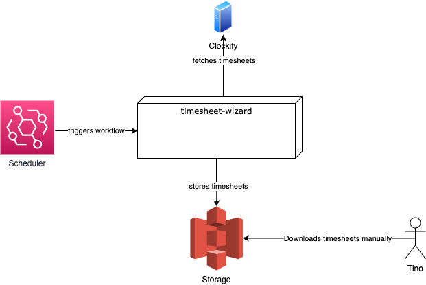

# System Scope and Context

## Business Context

### Scheduler (external system)

There is no human interaction needed to trigger the workflow. This is instead done by a scheduler at a given point of
time - e.g. sometimes at night, when a working day is completed

### Clockify (external system)

The external system that is providing an API to fetch the timesheets for a given timeframe

### Storage (external system)

The place where the generated Excel files are stored

### Tino (actor)

The user of the Timesheet-Wizard who downloads the timesheets when he needs them

## Technical Context

### AWS EventBridge  (external system)

Serves as a scheduler to trigger the workflow at a given point of
time - e.g. sometimes at night, when a working day is completed

### Clockify (external system)

The external system that is providing an API to fetch the timesheets for a given timeframe

### AWS S3 (external system)

The place where the generated Excel files as well as any intermediate files are stored
