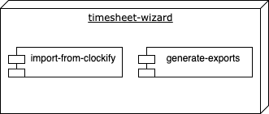
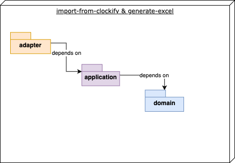
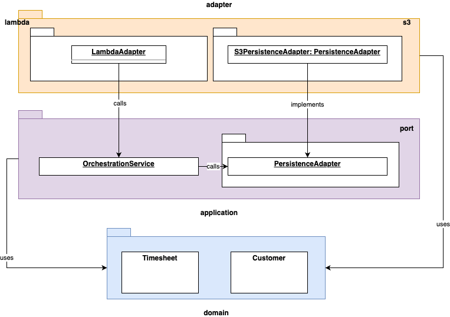

# Building Block View

## Level 1

The Timesheet-Wizard consists of two modules.

- **importer**: the timesheet, that can be fetched via the Clockify-API in json-format, is modelled in a very
  generic way and does not fit my use-cases. Therefor, this module is responsible to fetch the json from Clockify,
  transform it to the domain model of the Timesheet-Wizard and store it - again in json format - on S3.
- **documents-generator**: this module is responsible for downloading the json created by `importer` and generating an
  XLSX, PDF or CSV file from that data. The XLSX, PDF and CSV files then are again stored on S3, where it is available for a manual download.

## Level 2

Each of the modules follows a domain-centric Ports & Adapters architecture. As the architecture of both modules is
very similar, only the packages in general are documented here. The subtle differences between the modules will be
visible in the code immediately on the package level.

## Level 3

- The package 'domain' is in the
centre of the architecture without any dependencies to other parts of the system. 
- The entities in the domain-logic are
used by application services (package `application`) that are e.g. responsible for orchestrating the
workflow. 
- In this package there are also `port`-interfaces, which are implemented in package `adapter` to
invert dependencies. 
- Only `outgoing`-ports are decoupled via an interface, having one corresponding adapter.
E.g. there is an interface `PersistencePort`
implemented by class `S3PersistenceAdapter` to provide persisting capabilities via AWS S3.
- `Incoming`-adapters like the adapters to AWS Lambda are realized directly without a port-interface, since there is no
need for dependency inversion here.

