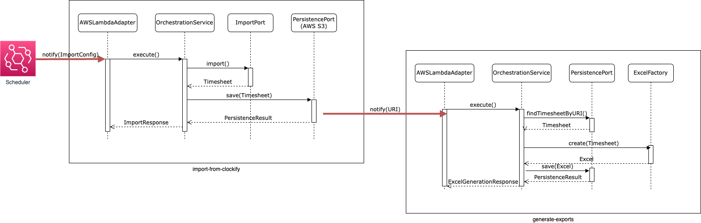

# Runtime View

## Level 1

'import-from-clockify' is invoked by a scheduler at a given point of
time - e.g. sometimes at night, when a working day is completed.

Both modules are decoupled and do not have dependencies on each other. 

This means, that '
import-from-clockify' does not call 'generate-excel' directly. Instead, events emitted by AWS S3 invoke '
generate-excel', after a new timesheet is imported by 'import-from-clockify'. To be more precise: an S3 'Put event'.

