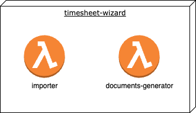

# Deployment View

The Timesheet-Wizard consists of two decoupled modules:

- importer
- documents-generator

Both are built with Gradle and deployed as an AWS CloudFormation stack via AWS-SAM and GitHub Actions.

'documents-generator' has a dependency on the [Apache POI](https://poi.apache.org/) jar-library to read and write
Excel-files. Unfortunately this library does not work being packaged into a GraalVM native image, so 'documents-generator' is
deployed as Quarkus application on a
a ['normal' Java 17 AWS lambda runtime](https://docs.aws.amazon.com/lambda/latest/dg/lambda-java.html). (--> Risk #R1)

'importer', on the contrary, functions very well as a GraalVM native image and is therefor deployed as a native
Micronaut application with
a [custom AWS Lambda runtime](https://docs.aws.amazon.com/lambda/latest/dg/runtimes-custom.html). 
