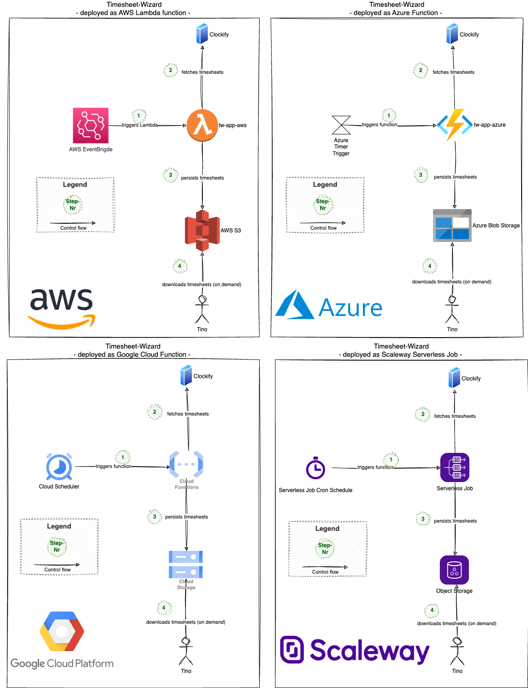

# System Scope and Context

## Business Context

From a business perspective, the Timesheet-Wizard sits between one time-tracking system and the timesheet files
Tino uses for book-keeping:

| Communication partner | Direction | Description                                                                                          |
|------------------------|-----------|--------------------------------------------------------------------------------------------------------|
| Clockify               | in        | Source of tracked working hours. The Timesheet-Wizard reads them; it never writes back to Clockify.  |
| Tino (actor)           | out       | Triggers a run indirectly (via schedule) or directly (locally), and downloads/reads the resulting XLSX, PDF, CSV or JSON files for book-keeping. |
| Generated files        | out       | XLSX, PDF, CSV and JSON exports of a timesheet — the product the Timesheet-Wizard exists to create.  |

## Technical Context

Each deployment target follows the same shape — scheduler triggers the workflow, the workflow reads from Clockify
and writes generated/intermediate files to cloud storage — with the concrete scheduler and storage service swapped
per cloud. `tw-app-local` has no scheduler or cloud storage; Tino invokes it directly and files land on the local
filesystem.

| Target          | Scheduler (external system)              | Storage (external system)  | Clockify (external system) | Tino (actor)                                          |
|------------------|--------------------------------------------|------------------------------|-------------------------------|--------------------------------------------------------|
| AWS              | AWS EventBridge                            | AWS S3                       | Provides the timesheet report API for the configured timeframe. | Downloads the generated files when he needs them, via a manual, authenticated login to the cloud console. |
| Azure            | Azure Function Timer                       | Azure Blob Storage           | (same as above)               | (same as above)                                         |
| Google Cloud     | Cloud Scheduler                            | Cloud Storage                 | (same as above)               | (same as above)                                         |
| Scaleway         | Scaleway Serverless Job Cron Schedule      | Object Storage                | (same as above)               | (same as above)                                         |
| Local            | none — Tino runs the jar directly          | local filesystem              | (same as above)               | Runs `java -jar` and reads the files directly from disk. |

In every case, "sometimes at night, when a working day is completed" is the typical schedule; the exact time is a
deployment-time configuration detail, not an architectural one.
