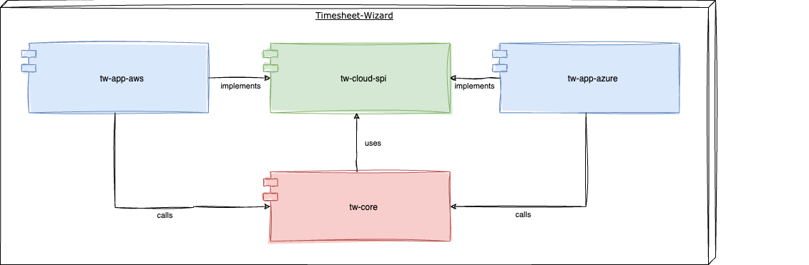

# Building Block View

## Level 1

The Timesheet-Wizard consists of the following Gradle subprojects:

- **tw-spi**: the service provider interface to be implemented for any cloud specific things. Like e.g. uploading
  timesheets to some cloud storage.
- **tw-core**: the core module that contains the business logic. This subproject is cloud-agnostic.
- **tw-app-aws**: implements the interfaces of tw-spi with AWS specific code and also bundles the cloud-agnostic
  `tw-core` with AWS specific things to an AWS Lambda function.
- **tw-app-azure**: implements the interfaces of tw-spi with Azure specific code and also bundles the
  cloud-agnostic `tw-core` with Azure specific things to an Azure function.
- **tw-app-gcp**: implements the interfaces of tw-spi with Google Cloud Platform specific code and also bundles the
  cloud-agnostic `tw-core` with Google Cloud Platform specific things to a Google Cloud function.

## Level 2

The tw-core Gradle subproject consists of two business modules and an anticorruption module.

- **importing**: the timesheet that can be fetched via the Clockify-API in JSON format is modeled in a very
  generic way and does not fit my use-cases. Therefore, this module is responsible for fetching the JSON from Clockify,
  transforming it to the domain model of the Timesheet-Wizard and signaling a successful import.
- **exporting**: this module is responsible for transforming the model created by `importing` by generating an
  XLSX, PDF or CSV file from that data. The XLSX, PDF and CSV files then are stored in some cloud storage, where they
  are available for a manual download.
- **anticorruption**: this module contains code that maps domain model classes and events of module `importing` to domain model
  classes and events of module `exporting`.

## Level 3

Both business modules follow a domain-centric Ports & Adapters architecture: The domain-logic is decoupled from the
infrastructure via the use of interfaces. These interfaces are implemented in adapters. Only outgoing adapters are
decoupled via interfaces, incoming adapters are not. ImportService & ExportService are responsible for orchestrating the
workflow.

