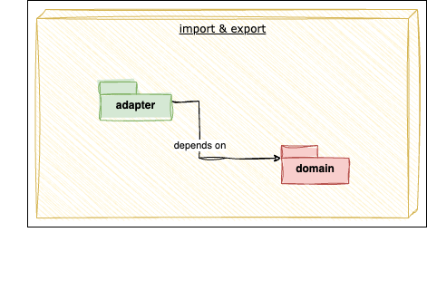
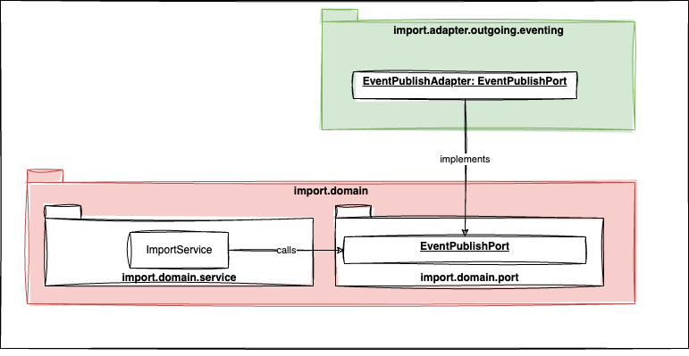

# Building Block View

# Level 1

The Timesheet-Wizard consists of the following Gradle subprojects:

- **tw-cloud-spi**: the service provider interface to be implemented for any cloud specific things. Like e.g. uploading
  timesheets to some cloud storage.
- **tw-core**: the core module that contains the business logic. This subproject is cloud-agnostic.
- **tw-app-aws**: implements the interfaces of tw-cloud-spi with AWS specific code and also bundles the cloud-agnostic
  tw-core with AWS specific things to an AWS Lambda function.

## Level 2

The tw-core Gradle subproject consists of two business modules and a shared module.

- **import**: the timesheet, that can be fetched via the Clockify-API in json-format, is modelled in a very
  generic way and does not fit my use-cases. Therefor, this module is responsible to fetch the json from Clockify,
  transform it to the domain model of the Timesheet-Wizard and signal a successful import.
- **export**: this module is responsible for transforming the model created by `import` by generating an
  XLSX, PDF or CSV file from that data. The XLSX, PDF and CSV files then are stored in some cloud storage, where they
  are available for a manual download.
- **shared**: this module contains code that is shared by the two business modules, like e.g. the domain model.

## Level 3

Both business modules follow a domain-centric Ports & Adapters architecture. As the architecture of both modules is
very similar, only the packages in general are documented here. The subtle differences between the modules will be
visible in the code immediately on the package level.

## Level 4

- The package 'model' is in the
  centre of the architecture without any dependencies to other parts of the system.
- The entities in the domain-logic are
  used by application services (e.g. ImportService & ExportService) that are e.g. responsible for orchestrating the
  workflow.
- In this package there are also `port`-interfaces, which are implemented in package `adapter` to
  invert dependencies.
- Only `outgoing`-ports are decoupled via an interface, having one corresponding adapter.

