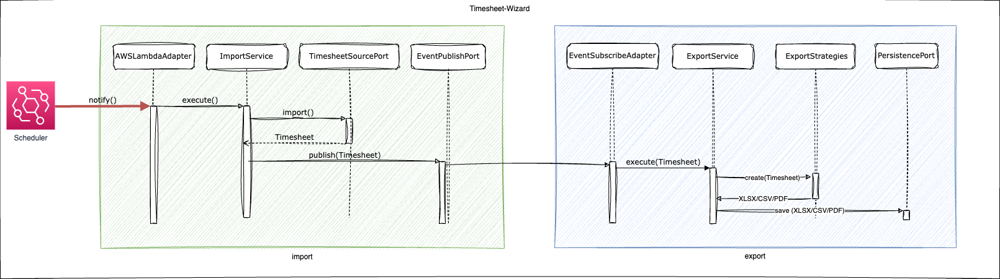

# Runtime View

## Level 1

`importing` is invoked by a scheduler at a given point of time – e.g. sometimes at night, when a working day is completed.

Both modules are decoupled via `anticorruption` and do not have dependencies on each other.

This means, that `importing` does not call `exporting` directly. Instead, (synchronous) events emitted invoke
`exporting`, after a new timesheet is successfully imported by `importing`.

