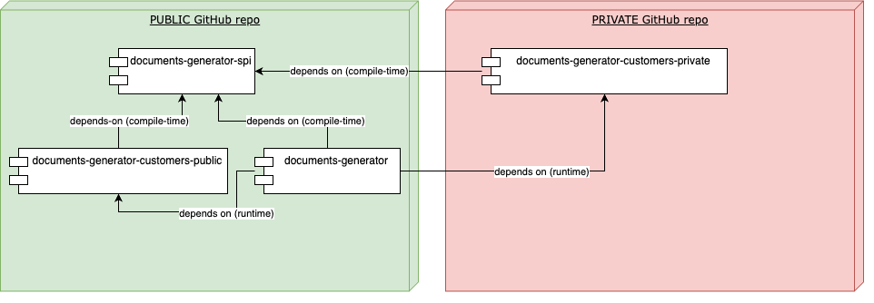

# Libs

Though most code of the Timesheet-Wizard is publicly exposed via this public GitHub-repository, any confidential
customer
related code resides in a private GitHub-repository.
The dependencies are visualized in the following diagram:

* `documents-generator-spi` serves as a service-provider-interface that is used as a compile-time-dependency in the
  other
  modules.
* At runtime, the libraries `documents-generator-customers-public` (for non-confidential/test customers) & `
  documents-generator-customers-private` (for confidential customers) are used by the `documents-generator`app,
  so that all customer-specific-code for the documents generation is executed. 
